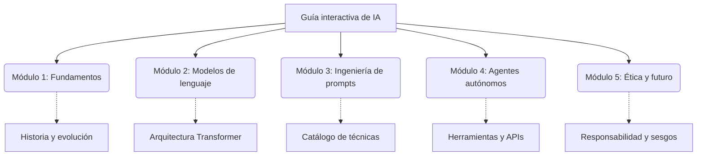

# Guía interactiva: Fundamentos de la inteligencia artificial

Este proyecto es una plataforma educativa interactiva diseñada para el estudio profundo de los **fundamentos de la inteligencia artificial**. La aplicación ofrece una experiencia de aprendizaje inmersiva, estructurada y altamente navegable, integrando elementos visuales y funcionales modernos para facilitar la comprensión de conceptos complejos, desde la arquitectura de los grandes modelos de lenguaje (LLM) hasta la ingeniería de agentes autónomos.

---

## 🚀 Características principales

- **Contenido modular y especializado:** Organizado en capítulos que cubren:
    - **Fundamentos:** Historia, tipos de IA y conceptos base.
    - **LLM:** Arquitectura Transformer, entrenamiento y mecanismos de atención.
    - **Ingeniería de prompts:** Técnicas desde *zero-shot* hasta *chain-of-thought*.
    - **Agentes de IA:** Autonomía, herramientas (APIs, *function calling*, RAG) y sistemas multiagente.
    - **Ética y futuro:** Sesgos, responsabilidad y la senda hacia la AGI.
- **Catálogo interactivo de técnicas:** Galería visual y tabla técnica de más de 15 técnicas de *prompting* con ejemplos prácticos y opción de copiado rápido.
- **Visualización avanzada de conceptos:**
    - **Diagramas dinámicos:** Arquitectura Transformer simplificada y flujo de trabajo multiagente (orquestador, especialistas y herramientas).
    - **Tablas comparativas:** Desglose de niveles de autonomía agéntica y comparativa técnica entre RAG y *chain-of-thought*.
- **Navegación inteligente:** Barra lateral dinámica con sistema de *scroll spy* y progreso de lectura en tiempo real.
- **Interactividad y accesibilidad:**
    - **Glosario emergente:** Definiciones instantáneas al pasar el cursor.
    - **Cuestionarios interactivos:** Evaluaciones modulares con retroalimentación inmediata.
    - **Norma de capitalización del español:** Todo el contenido sigue estrictamente las reglas gramaticales de capitalización en español.
- **Referencias académicas:** Bibliografía actualizada siguiendo la norma **APA7**.

---

## 🏗️ Arquitectura y contenido

A continuación, un esquema visual de la estructura modular de la aplicación:

### Tabla de niveles de autonomía (ejemplo de contenido)

| Nivel | Descripción | Intervención humana |
| :--- | :--- | :--- |
| **Nivel 1** | Automatización sin IA (basada en reglas) | Alta (programación manual) |
| **Nivel 2** | Automatización con IA generativa (oráculo) | Alta (solicitar e integrar) |
| **Nivel 3** | Workflow agéntico de baja autonomía | Media (aprobar acciones) |
| **Nivel 4** | Workflow agéntico de autonomía moderada | Baja (supervisión) |
| **Nivel 5** | Workflow agéntico de elevada autonomía | Nula (operación autónoma) |

---

## 🛠️ Funciones del sistema

1. **Gestión de capítulos:** Navegación fluida entre módulos con persistencia de estado y modo lectura (*focus mode*).
2. **Motor de evaluación:** Sistema de cuestionarios que valida el conocimiento adquirido con retroalimentación de respuestas.
3. **Herramientas de productividad:** Botones integrados para copiar ejemplos de *prompts* optimizados directamente al portapapeles.
4. **Seguimiento dinámico:** Cálculo del porcentaje de lectura basado en el desplazamiento y la interacción del usuario.
5. **Interfaz responsiva:** Diseño adaptativo para dispositivos móviles, tabletas y computadoras, con menú lateral colapsable.

---

## 💻 Stack tecnológico

| Tecnología | Rol principal en el proyecto |
| :--- | :--- |
|  **React 18** | Biblioteca base para la interfaz de usuario reactiva |
|  **TypeScript** | Tipado estático para robustez y prevención de errores |
|  **Vite** | Herramienta de compilación ultrarrápida y desarrollo |
|  **Tailwind CSS 4** | Sistema de diseño basado en utilidades y variables |
|  **Framer Motion** | Motor de animaciones fluidas para transiciones y UI |
|  **Lucide React** | Ecosistema de iconos vectoriales limpios y escalables |

---

## 📄 Créditos y autoría

Este proyecto fue ideado, diseñado y desarrollado íntegramente por:

**Francisco Sereño**  

---

## ⚖️ Licencia

Este material se distribuye bajo una licencia **Creative Commons (CC BY-NC-SA 4.0)**. Puede ser compartido y adaptado para fines no comerciales, siempre que se otorgue el crédito apropiado al autor original.
